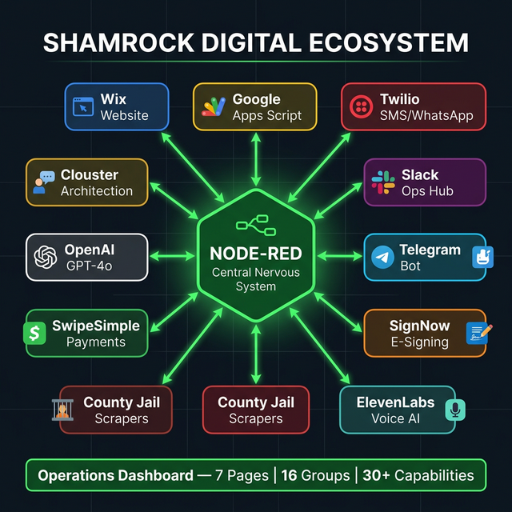
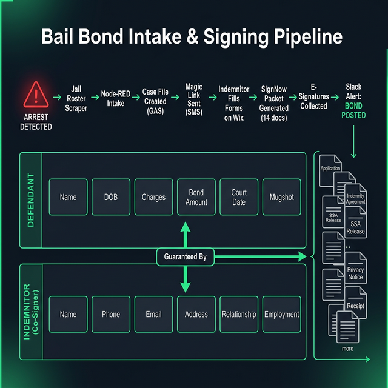
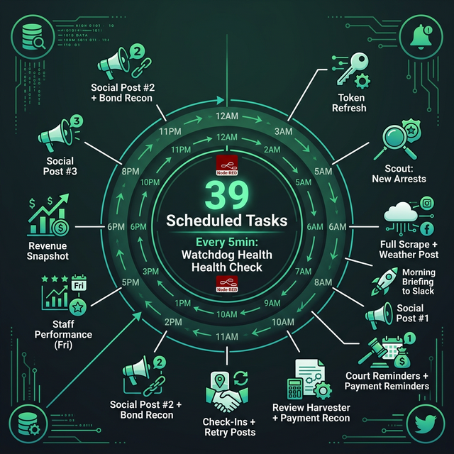

# 🗺 OVERVIEW.md — The Big Picture

> **Visual map of the entire Shamrock Node-RED ecosystem.**
> For AI agents and humans who need to understand the whole system at a glance.

---

## 🌐 Ecosystem Map

Node-RED sits at the center of the Shamrock tech stack, routing data between 10+ external services.



### What's Connected

| System | Direction | What Flows |
|---|---|---|
| **Wix Website** | → Node-RED | Intake forms, magic link clicks, form submissions |
| **Google Apps Script** | ← → Node-RED | PDF generation, CRM updates, court dates, AI processing |
| **Twilio** | ← Node-RED | SMS reminders, WhatsApp campaigns, verification codes |
| **Slack** | ← Node-RED | All operational alerts, daily briefings, error notifications |
| **Telegram** | ← → Node-RED | Client chat bot, conversation handler, mini-app |
| **SignNow** | ← → Node-RED | Document signing events, packet status tracking |
| **ElevenLabs** | ← Node-RED | AI voice calls for outreach and reminders |
| **County Jails** | → Node-RED | Arrest data via scrapers (Lee, Collier, Charlotte+) |
| **SwipeSimple** | → Node-RED (via GAS) | Payment data, revenue tracking |
| **OpenAI** | ← → GAS (via Node-RED) | AI-powered responses, risk analysis |

---

## 📋 Intake & Signing Pipeline

This is the core business flow — from arrest to bond posted, fully automated.



### The 8-Step Pipeline

| Step | System | Action |
|---|---|---|
| 1. **Arrest Detected** | County Jail Scraper | Automated scrape finds new booking |
| 2. **Node-RED Intake** | Node-RED | Routes arrest data, creates Slack alert |
| 3. **Case File Created** | Google Apps Script | Full case record with charges, bond amount |
| 4. **Magic Link Sent** | Twilio SMS | Indemnitor receives Wix intake link |
| 5. **Forms Filled** | Wix Website | Indemnitor enters defendant + personal info |
| 6. **Packet Generated** | SignNow (via GAS) | 14 documents pre-filled and sent for signing |
| 7. **Signatures Collected** | SignNow | E-signatures from indemnitor on all docs |
| 8. **Bond Posted** | Slack + GAS | Alert: "🎉 BOND POSTED" to #bonds-live |

### Defendant vs. Indemnitor — Who's Who

```
┌─────────────────────────────────────────────────────────┐
│  DEFENDANT (the person in jail)                         │
│                                                         │
│  ┌──────────┬─────────┬──────────┬───────────┐          │
│  │  Name    │  DOB    │ Charges  │Bond Amount│          │
│  └──────────┴─────────┴──────────┴───────────┘          │
│  ┌──────────┬─────────┬──────────┐                      │
│  │Court Date│ Booking#│ Mugshot  │                      │
│  └──────────┴─────────┴──────────┘                      │
│                        ▲                                │
│                        │ "Guaranteed By"                │
│                        ▼                                │
│  INDEMNITOR (the co-signer paying the premium)          │
│                                                         │
│  ┌──────────┬─────────┬──────────┬───────────┐          │
│  │  Name    │  Phone  │  Email   │  Address  │          │
│  └──────────┴─────────┴──────────┴───────────┘          │
│  ┌────────────┬───────────┬────────────┐                │
│  │Relationship│Employment │  Income    │                │
│  └────────────┴───────────┴────────────┘                │
└─────────────────────────────────────────────────────────┘
```

### The 14 SignNow Documents

| # | Document | Signer | Purpose |
|---|---|---|---|
| 1 | Bail Bond Application | Indemnitor | Start the bond process |
| 2 | General Indemnity Agreement | Indemnitor | Financial responsibility |
| 3 | SSA Release (Primary) | Defendant | Social Security verification |
| 4 | SSA Release (Co-signer) | Indemnitor | Social Security verification |
| 5 | Privacy Notice | Indemnitor | Privacy policy acknowledgment |
| 6 | Receipt of Premium | Indemnitor | Payment confirmation |
| 7 | Notice to Indemnitor | Indemnitor | Legal obligations |
| 8 | Bail Undertaking | Indemnitor | Promise to bring defendant |
| 9 | Affidavit | Indemnitor | Sworn statement of facts |
| 10 | Authorization to Release | Defendant | Release of information |
| 11 | Collateral Agreement | Indemnitor | Collateral terms (if any) |
| 12 | Payment Plan Agreement | Indemnitor | Installment terms (if any) |
| 13 | Power of Attorney | Agent | Agent authority documentation |
| 14 | Surety Declaration | Agent | Surety company declaration |

---

## ⏰ 24-Hour Automation Cycle

Node-RED runs 39 scheduled tasks across a full 24-hour cycle, plus continuous health monitoring.



### Peak Windows (Watch for Load)

| Time Window | Tasks Firing | Risk |
|---|---|---|
| **6:00 AM** | Scout + Full Scrape + Weather + Sex Offender Sync | 🔴 4 tasks — heaviest GAS load |
| **9:00 AM** | Court Reminders + Payment Reminders | 🟡 SMS volume spike |
| **11:00 AM** | Check-Ins + Retry Posts | 🟡 Moderate GAS + SMS |

### Always-On Monitors

| Interval | Task | Purpose |
|---|---|---|
| Every **5 min** | Watchdog Health Check | Endpoint availability |
| Every **5 min** | GAS Event Queue | Process async events |
| Every **10 min** | Jail Poll | Detect new arrests |
| Every **10 min** | GAS Batch Queue | Process batch jobs |
| Every **30 min** | Court Clerk, Closer, WhatsApp, SignNow | Core business operations |

---

## 🧑‍💼 Digital Workforce at a Glance

```
┌──────────────────────────────────────────────────────────────────┐
│                    THE DIGITAL WORKFORCE                         │
│                                                                  │
│  🛎 Concierge    📋 Clerk      📊 Analyst    🔍 Investigator     │
│  "Front Desk"   "Data Entry"  "Underwriter" "Background Check"  │
│  Chat/SMS/WA    Scrapers      Risk Scoring   TLO/IRB/CLEAR      │
│                                                                  │
│  📱 Closer      ⚖️ Court Clerk  🏹 Bounty Hunter  🐕 Watchdog   │
│  "Follow-Up"   "Calendar"    "Big Fish"      "Health Monitor"   │
│  Drip SMS/WA   Court Dates   >$2.5K Bonds    5-min Checks       │
│                                                                  │
│  🕵️ Scout                                                        │
│  "Expansion"                                                     │
│  New Counties                                                    │
└──────────────────────────────────────────────────────────────────┘
```

Each agent has a dedicated Node-RED tab with its own triggers, processing logic, and output channels. See [AGENTS.md](../.agents/AGENTS.md) for full details.

---

## 📊 Dashboard Pages

```
┌─────────────────────────────────────────────────────────────┐
│                 OPERATIONS DASHBOARD                         │
│                 http://localhost:1880/dashboard               │
│                                                              │
│  Page 1: Operations Radar                                    │
│  ├── Booking Radar (live arrests, scraper controls)          │
│  └── Clerical Operations (county scrape buttons)             │
│                                                              │
│  Page 2: The Concierge (Ops)                                 │
│  ├── Omni-Inbox (chat feed, conversation view)               │
│  └── AI Ops & Controls (AI toggle, FAQ containment)          │
│                                                              │
│  Page 3: The Analyst (Risk Ops)                              │
│  ├── Background Investigations (search forms, IRB)           │
│  └── Underwriting & Risk Analysis (scoring, red flags)       │
│                                                              │
│  Page 4: Revenue & Closing Ops                               │
│  ├── Sales Funnel & Metrics (charts, revenue)                │
│  └── Packet Tracking (SignNow status, magic links)           │
│                                                              │
│  Page 5: DevOps & Infrastructure                             │
│  ├── System Health (gauges, GAS bridge status)               │
│  └── DevOps Command Center (ElevenLabs dialer, PANIC)        │
│                                                              │
│  Page 6: Agency Management                                   │
│  ├── Automated Reporting (liability, commission, recon)      │
│  └── Client & Payment Operations (reminders, check-ins)      │
│                                                              │
│  Page 7: Operations                                          │
│  ├── Court Filings Generator (court docs, override)          │
│  └── AI Automation Control (walk-out watch, auto check-in)   │
└─────────────────────────────────────────────────────────────┘
```

---

## 📐 Data Flow Patterns

### Pattern 1: Cron → GAS → Slack
Most automated tasks follow this pattern:
```
⏰ Cron Trigger → 📝 Prepare Payload (function) → 🌐 POST to GAS → 📊 Format Result → 📣 POST to Slack
```

### Pattern 2: Webhook → Process → Alert
Inbound events from external services:
```
📡 HTTP Webhook → 🔍 Validate/Parse → 📝 Process (function) → 📣 Slack Alert + 🌐 GAS Update
```

### Pattern 3: Form → API → Dashboard
Dashboard form interactions:
```
📋 Dashboard Form → 📝 Format Payload → 🌐 API Call (GAS/Twilio/11Labs) → 📊 Update Dashboard Widget
```

### Pattern 4: Scraper → Filter → Outreach
Proactive lead generation:
```
⏰ Cron → 🖥 exec: Run Scraper → 🔍 Filter Results → 📱 SMS/WhatsApp Outreach → 📣 Slack Alert
```

---

## Quick Links

| Resource | URL |
|---|---|
| Node-RED Editor | http://localhost:1880 |
| Operations Dashboard | http://localhost:1880/dashboard |
| GitHub Repo | https://github.com/Shamrock2245/shamrock-node-red |
| Portal Site Repo | https://github.com/Shamrock2245/shamrock-bail-portal-site |
| Full Doc Index | [README.md](../README.md) |
